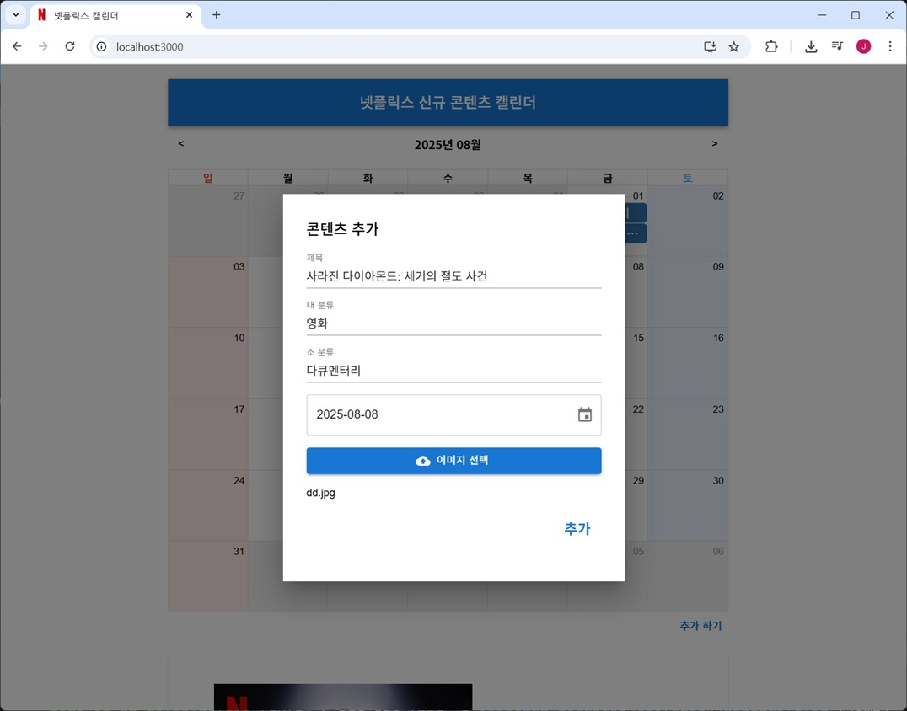

# 리액트, 스프링부트를 기반 넷플릭스 신규 콘텐츠 출시 달력

## 소개

- 넷플릭스 신규 콘텐츠 출시일을 달력으로 한눈에 볼 수 있는 웹   
- 프런트엔드: 리액트, MUI 사용

- 달력에 제목 클릭시 상세 정보 출력   

- 추가 하기 기능   

- 날짜 선택 및 사진 업로드 기능   

- 삭제 기능   

- 백엔드 : 스프링 부트, RESTFul API, JPA, H2 embeded 사용   

